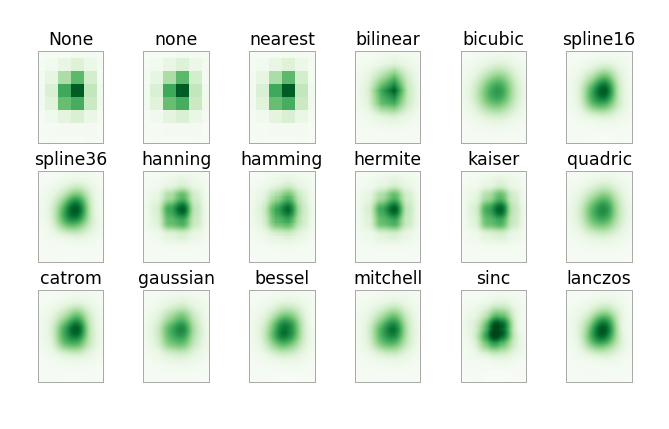
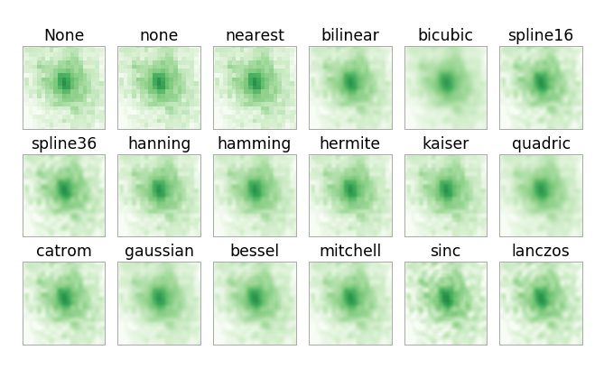

## Smoothing script developed in the Aggienova Spring 2019 repository.

Takes a input image and outputs an array of 18 subplots consisting of the input image smoothed by various interpolation formulas.

Output examples: 

